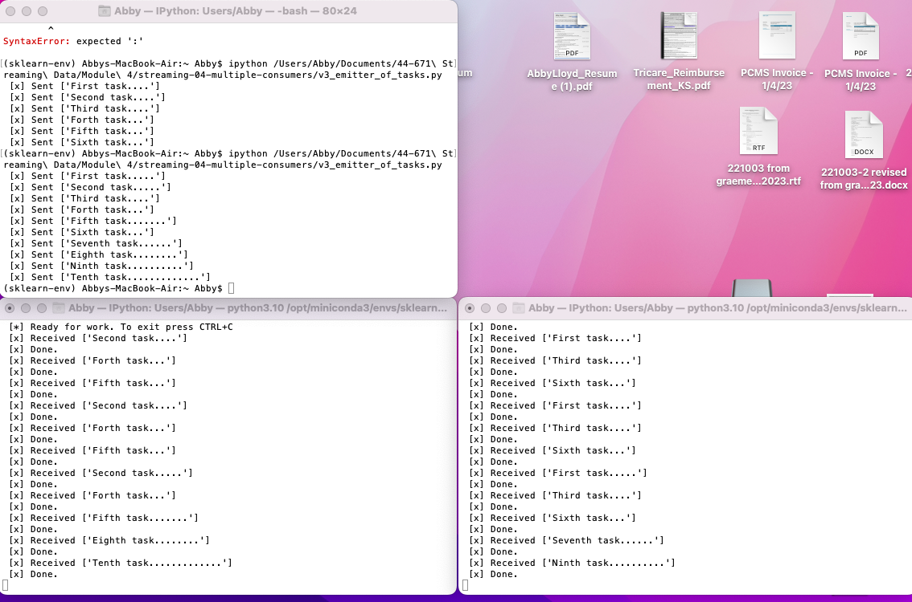

# streaming-04-multiple-consumers
## Abby Lloyd
## 3 Feb 2023

> Use RabbitMQ to distribute tasks to multiple workers

One process will create task messages. Multiple worker processes will share the work. 

## Before You Begin

1. Fork this starter repo into your GitHub.
1. Clone your repo down to your machine.
1. View / Command Palette - then Python: Select Interpreter
1. Select your conda environment. 

## Read

1. Read the [RabbitMQ Tutorial - Work Queues](https://www.rabbitmq.com/tutorials/tutorial-two-python.html)
1. Read the code and comments in this repo.

## RabbitMQ Admin 

RabbitMQ comes with an admin panel. When you run the task emitter, reply y to open it. 

(Python makes it easy to open a web page - see the code to learn how.)

## Three different versions
- Version 1 & 2: Both of these versions send a message that has been manually entered.
- Version 3 reads a CSV file, and sends each row as a separate message.
- Version 3 automatically opens the admin panel without asking. This can be changed by changing the variable show_offer to True in the emitter file. 
- All versions use periods ("...") at the end of the messages to stimulate time to compelete the tasks.

## Execute the Producer

1. Run emitter_of_tasks.py (say y to monitor RabbitMQ queues)

Explore the RabbitMQ website.

## Execute a Consumer / Worker

1. Run listening_worker.py

Will it terminate on its own? How do you know? 
- Consumers are meant to be long lived. They last as long as the connection is good or until they are manually stopped.

## Ready for Work

1. Use your emitter_of_tasks to produce more task messages.

## Start Another Listening Worker 

1. Use your listening_worker.py script to launch a second worker. 

Follow the tutorial. 
Add multiple tasks (e.g. First message, Second message, etc.)
How are tasks distributed? 
- When the consumer completes one task, it takes the next one.
Monitor the windows with at least two workers. 
Which worker gets which tasks?
- The worker takes the next task in the queue once it has completed its current task. If one consumer is taking a long time on one task, another consumer may complete multiple short tasks from the queue in a row.

## Reference

- [RabbitMQ Tutorial - Work Queues](https://www.rabbitmq.com/tutorials/tutorial-two-python.html)

## Screenshot

See a running example with at least 3 concurrent process windows here:

